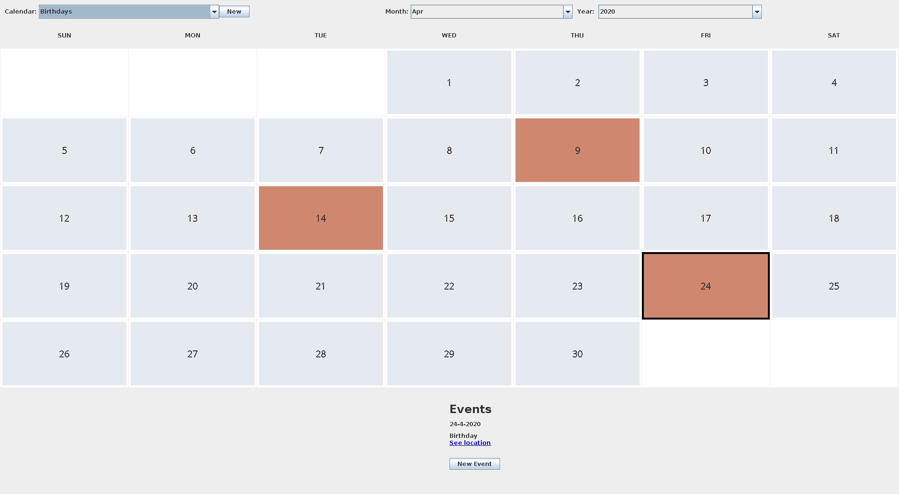

# Swing-calendar
A desktop app made using Java Swing to create calendar events

## To run
```
cd build
java -jar swing-calendar-java-X.Y-SNAPSHOT.jar
```
where X.Y is the version number

## To build
To build the source, run
```
./mvnw clean package
```

## Screenshot


